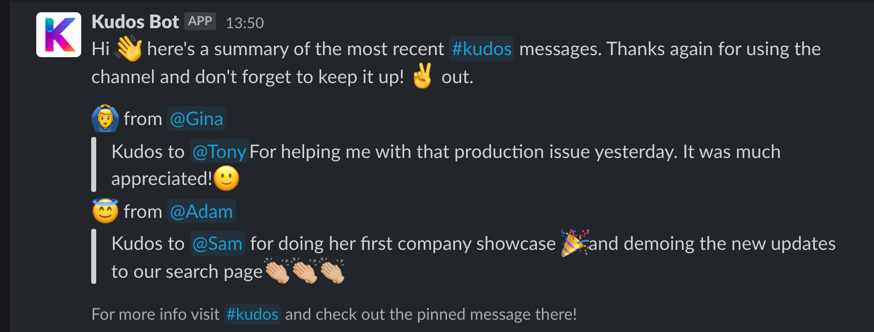

# Kudos Bot

**This installations & setup in this README.md is still a WIP :)**

A self-managed slack kudos bot that will send a slack message with a collate and summarise a list of kudos message every week. This has helped my company increase exposure of the kudos we send so we can really shout about the good things going on here!  

*Note - This hasn't really been made to be something that's "plug and play". The benefit of using this project is that if you are technically minded, then you can customise the code as you see fit. Also, the whole thing can be self-managed on your own cloud infrastructure. If that's too much faff, then you can google some alternatives which exist on the slack app store, I won't be offended :)*



## Getting Started
Running on your machine is pretty simple and can be done in 3 simples steps.

1. Create a slack workspace to use as your testing playground, create a channel which will act as your #kudos channel, and a second to act as te channel you will send you summary messages to. Write some messages into the kudos slack channel which say either 'thanks', 'thank you' or 'kudos' to act as your test data.

2. Set environment variables - As long as you have the below environment variables set then the app will run. As a quick start, you can add these using the terminal.

```
export SLACK_SIGNING_SECRET=your-signing-secret
export SLACK_TOKEN=your-slack-token
export SLACK_URL=https://yourslackworkspaceurl.slack.com
export KUDOS_CHANNEL_ID=kudosChannelId
export SEND_KUDOS_SUMMARY_TO_CHANNEL_ID=summaryToSumamryId
```

3. Run the app using `npm start`
That's it! As long as you have kudos messages in your test kudos channel, then a summary message which looks a bit like the one above should have been sent.

## Prerequisites

### Kudos Slack Channel

The installation assumes you've created a slack channel already where your teams give kudos e.g. #kudos

### Technical Skills

You will need a basic understanding of javascript, node and creating applications to access the slack api. You will also need some knowledge of Google Cloud Platform or similar technology.

### Installation & Setup
The steps to getting this kudos bot running can be summed up in the following steps. This guide will be using Google Cloud Platform, but if You are an AWS user, then it should be possible to adjust this. 

#### 1. Fork this repo

#### 2. Create a slack bot 
Creating a slack bot will give you a Access Token and Signing Secret, giving you access to use the slack api. See slack documentation for tutorials on how to do that https://slack.com/intl/en-gb/help/articles/115005265703-Create-a-bot-for-your-workspace

#### 3. Deploy your function to GCP
You can do this either by using the cloudbuild.yml included in this project, or by using the GCP UI.
```
gcloud functions deploy sendKudos \
--runtime nodejs14 \
 --set-env-vars SLACK_SIGNING_SECRET=REPLACE_ME,SLACK_TOKEN=xxxx-REPLACE-ME,SLACK_URL=https://replaceme.slack.com,KUDOS_CHANNEL_ID=REPLACE_ME,SEND_KUDOS_SUMMARY_TO_CHANNEL_ID=REPLACE_ME
```

#### 4. Create a scheduled job to run your cloud function
To achieve this, we will be using the Cloud Scheduler product in GCP. 

Below is a snippet for a cron trigger which runs every monday at 10am which is what I use.
```
# Every Monday cron trigger
0 10 * * MON
```

#### 5. Store your slack signing secret and token somewhere secret
To achieve this in GCP, I use Secret Manager to store the `kudos-slack-token` and `kudos-slack-signing-secret` secrets.
